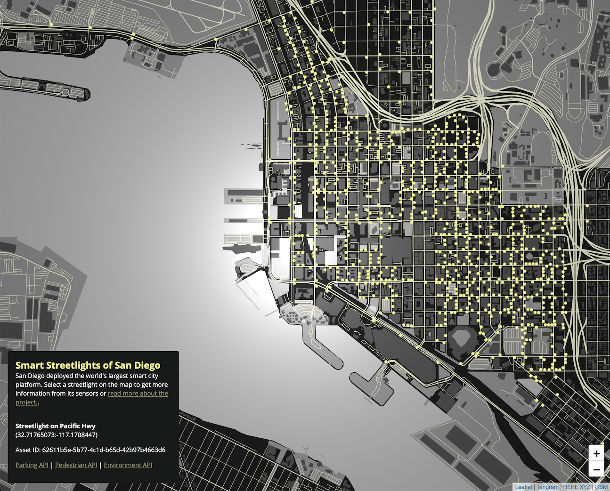

# Smart Streetlights of San Diego

San Diego deployed the world's largest smart city platform.  Select a
streetlight on the map to get more information from its sensors.

* Read more about [San Diego's Smart City](https://www.sandiego.gov/sustainability/energy-and-water-efficiency/programs-projects/smart-city)
* Learn more about [HERE XYZ](https://here.xyz) which was used in creating this map
* Learn more about [City IQ](https://docs.cityiq.io/) which processes the data

__[Live Map](https://heremaps.github.io/xyz-showcase/san-diego-streetlights)__

